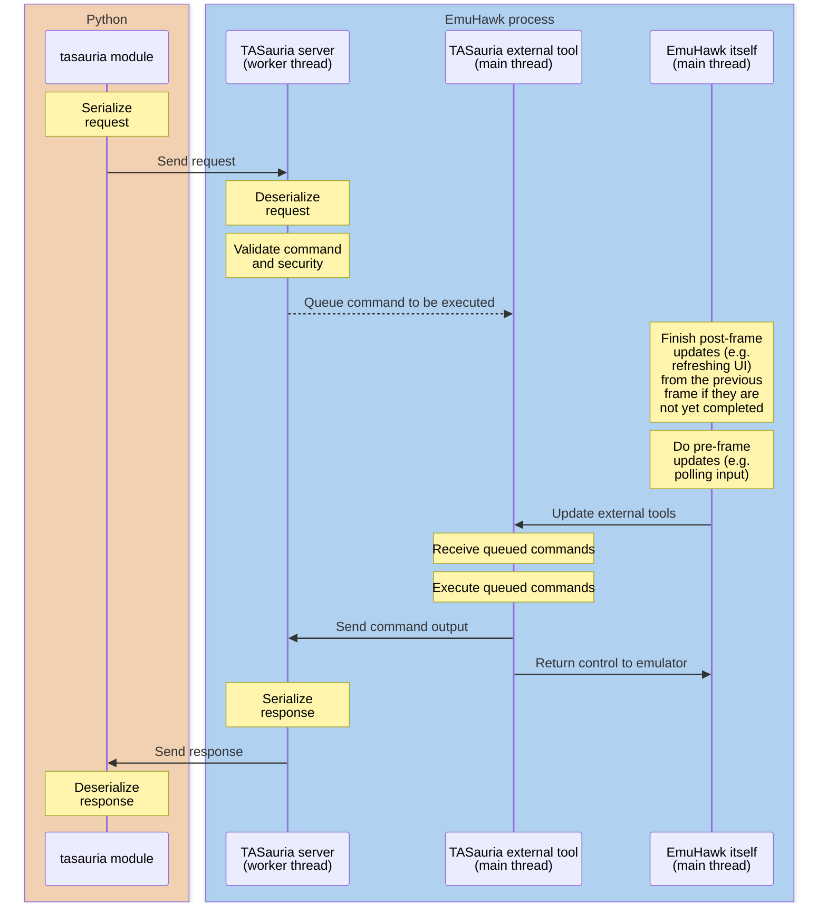

# Performance

Because of the nature of the setup TASauria produces, there is a lot of potential for performance loss when writing TASauria scripts.

In typical TAS situations, this usually isn't too big of a deal. It's expected that a TAS would take significantly longer to produce than running the game at full speed. However, it's still advantageous, especially in the development stage, for us to avoid losing time while executing our scripts.

Below is a diagram of what occurs when a typical request, let's say `await emu.readrange(0x1000)`, is executed.



## Speeding things up

There are a lot of slowdowns here that can be addressed:

### 1. The `tasauria` module needs to wait for the whole process to finish.

Because it needs to wait for all of the work of the plugin to be done before it can report results, simply executing commands normally results in a long wait time on the Python side.

This is why the `tasauria` module is implemented using `asyncio`. It is possible to use its asynchronous capabilities to, for instance, pull information from two different emulators at once:

```python
buffer_1, buffer_2 = await asyncio.gather(
    emulator_1.readrange(0x1000, domain='RDRAM'),
    emulator_2.readrange(0x1000, domain='RDRAM'),
)
```

You can read more about how `asyncio` works in its [Python documentation](https://docs.python.org/3/library/asyncio.html), but in essence, the first request would be sent, and then the second request would be sent while Python is still waiting for the first response.

This means instead of having to wait the amount of time it takes for two different requests, it will only take whatever amount of time is required to execute the slowest of the two.

### 2. Communication between the module and the server takes time.

It can take a while for the processes of handshaking and communicating the request to complete.

For this reason, TASauria exposes both an HTTP and WebSocket server.
Using the WebSocket server allows a persistent connection to be held and reused, saving time that would otherwise be used to establish it every time.

If you instantiate `TASauria` with no arguments, it uses the WebSocket server by default:

```python
from tasauria import TASauria

emu = TASauria()
# is equivalent to
emu = TASauria("ws://127.0.0.1:20251/websocket")
```

However, if you have specified a custom host or port, you will need to specify the path specifically.

TASauria automatically detects from the protocol that it should use the WebSocket connection, so all it takes is specifying as such in the constructor:

```python
emu = TASauria("http://192.168.1.50:30000/") # [!code --]
emu = TASauria("ws://192.168.1.50:30000/websocket") # [!code ++]
```

### 3. Waiting for the emulator's main thread to be ready to accept requests takes time.

The TASauria server instantiates worker threads for individual requests, and when the TASauria external tool receives control it will consume and execute as many queued commands as possible.

This means that employing the other speed-up techniques above *can* limit the amount of times the main thread has to sync to execute the commands.

However, TASauria also has a built-in way to batch commands together, making it possible to do multiple things in a single request.

Some high-level functions expose this functionality directly, such as `emu.readstructs`:

```python
(
    (player_x, player_y, player_z),
    (camera_x, camera_y, camera_z),
) = await emu.readstructs([
    (0x10F1B0, ">fff"),
    (0x0B1D9C, ">fff")
], domain='RDRAM')
```

However, if you're willing to get your hands dirty, you can also use `emu.batch_commands` to do this command batching yourself.

You will need to read the [HTTP/WS documentation](../http-ws-api/general) and probably the module source code as well to get a sense of how to do it, but here is an example:

```python
from tasauria import TASauria
from tasauria.commands.client import ClientFrameStatusCommand, ClientGameCommand

async with TASauria() as emu:
    (game_info, frame_status) = await emu.batch_commands([
        (ClientGameCommand, {}),
        (ClientFrameStatusCommand, {}),
    ])

    print(game_info)
    # => GameInfo(loaded=True, name='Zelda no Densetsu - Kamigami no Triforce (Japan)', system='SNES', board_type='LOROM-RAM#A', region='', display_type='NTSC', hash='E7E852F0159CE612E3911164878A9B08B3CB9060', in_database=True, database_status='GoodDump', database_status_bad=False, game_options={})
    print(frame_status)
    # => FrameStatus(cycle_count=229021140, frame_count=641, lag_count=281, is_lagged=False)

```

Batched commands are guaranteed to be run on the same frame, even if the emulator is not paused, so long as you do not use a command to advance the frame manually.

In addition, commands will be executed in sequence, so a `MemoryReadRangeCommand`, then a `ClientFrameAdvanceCommand`, and a `MemoryReadRangeCommand`, will result in the first read being done on the current frame and the second read being done on the second frame.

One caveat of this approach is that if any of the commands specified are not found (hard to do from Python's end), or if they fail security (i.e. they need a permission, and it is not checked in the TASauria external tool window), none of the commands will be executed.
This is to try and make batching atomic and prevent scripts from easily getting into ambiguous states.

## When nothing else works

If the thing you're doing is absolutely dependent on execution speed, it may be time to try something other than TASauria to solve your problem.

You can read onto the [Alternatives](alternatives) in the next section.
