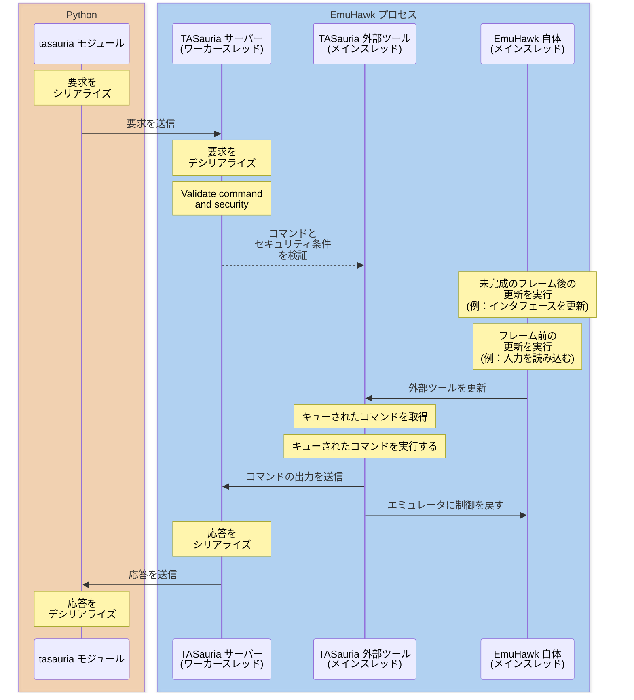

# パフォーマンス

TASauria の構造のため、 TASauria スクリプトを作成するときに性能低下の可能性が多くあります。

典型的な TAS シナリオでは、これはあまり大きな問題ではありません。TAS を生成するのにゲームをフルスピードで実行するよりもかなり長い時間がかかると予想されます。しかし、開発段階では特に、スクリプト実行中に時間を失わないようにすることが有利です。

以下は、典型的なリクエスト（例えば `await emu.readrange(0x1000)`）が実行されたときに何が起こるかを示す図です。



## スピードアップの方法

以下に対処できる遅延が多くあります：

### 1. `tasauria` モジュールは、フレーム処理が終了するまで待つ必要があります。

プラグインのすべての作業が完了するまで待つ必要があるため、通常通りにコマンドを実行すると Python 側で長い待機時間になります。

このため、`tasauria` モジュールは `asyncio` を使用して実装されています。非同期機能を使って、例えば 2 つの別々のエミュレータから同時に情報を取得できる例を示します：

```python
buffer_1, buffer_2 = await asyncio.gather(
    emulator_1.readrange(0x1000, domain='RDRAM'),
    emulator_2.readrange(0x1000, domain='RDRAM'),
)
```

asyncio の動作については、 [Python ドキュメント](https://docs.python.org/ja/3/library/asyncio.html) でさらに詳しく読むことができますが、実質的には最初のリクエストが送信され、Python が最初のレスポンスを待っている間に 2 番目のリクエストが送信されます。

つまり、2 つの別々のリクエストの時間を待つ代わりに、2 つのうち遅い方の実行に必要な時間だけを待つことになります。

### 2. モジュールとサーバー間の通信に時間がかかります。

ハンドシェイクとリクエストの通信プロセスが完了するまでに時間がかかることがあります。

このため、TASauria は HTTP と WebSocket の両方のサーバーを公開しています。
WebSocket サーバーを使用すると、永続的な接続を保持し再利用できるため、毎回接続を確立するためにかかる時間を節約できます。

`TASauria` を引数なしでインスタンス化すると、デフォルトで WebSocket サーバーが使用されます：

```python
from tasauria import TASauria

emu = TASauria()
# 以下と同じです
emu = TASauria("ws://127.0.0.1:20251/websocket")
```

ただし、カスタムホストやポートを指定した場合は、パスを明示的に指定する必要があります。

TASauria はプロトコルから WebSocket 接続を使用すべきことを自動的に検出するため、コンストラクタでそのように指定するだけで済みます：

```python
emu = TASauria("http://192.168.1.50:30000/") # [!code --]
emu = TASauria("ws://192.168.1.50:30000/websocket") # [!code ++]
```

### 3. エミュレータのメインスレッドがリクエストを受け付ける準備ができるまで待つのに時間がかかります。

TASauria サーバーは個々のリクエスト用にワーカースレッドを生成し、TASauria 外部ツールが制御を受け取ると、可能な限り多くのキューされたコマンドを消費して実行します。

つまり、上記の他の速度アップ手法を使用すると、メインスレッドがコマンドを実行するために同期する回数を減らすことができます。

ただし、TASauria にはコマンドを一括処理する組み込み機能もあり、1 つのリクエストで複数の処理を行うことが可能です。

一部の高レベル関数はこの機能を直接公開しています (例えば、`emu.readstructs`):

```python
(
    (player_x, player_y, player_z),
    (camera_x, camera_y, camera_z),
) = await emu.readstructs([
    (0x10F1B0, ">fff"),
    (0x0B1D9C, ">fff")
], domain='RDRAM')
```

ただし、手間を惜しまない場合は、`emu.batch_commands` を使って自分でコマンドバッチングを行うこともできます。

[HTTP/WS ドキュメント](../http-ws-api/general) とおそらくモジュールのソースコードを読む必要がありますが、以下に例を示します

```python
from tasauria import TASauria
from tasauria.commands.client import ClientFrameStatusCommand, ClientGameCommand

async with TASauria() as emu:
    (game_info, frame_status) = await emu.batch_commands([
        (ClientGameCommand, {}),
        (ClientFrameStatusCommand, {}),
    ])

    print(game_info)
    # => GameInfo(loaded=True, name='Zelda no Densetsu - Kamigami no Triforce (Japan)', system='SNES', board_type='LOROM-RAM#A', region='', display_type='NTSC', hash='E7E852F0159CE612E3911164878A9B08B3CB9060', in_database=True, database_status='GoodDump', database_status_bad=False, game_options={})
    print(frame_status)
    # => FrameStatus(cycle_count=229021140, frame_count=641, lag_count=281, is_lagged=False)

```

バッチ化されたコマンドは、エミュレータが停止していない場合でも、手動でフレームを進めるコマンドを使用しない限り、同じフレームで実行されることが保証されています。

さらに、コマンドは順序通りに実行されるため、`MemoryReadRangeCommand`、次に `ClientFrameAdvanceCommand`、そして `MemoryReadRangeCommand` の順で実行すると、最初の読み取りは現在のフレームで、2 回目の読み取りは次のフレームで行われます。

この方法の注意点は、指定されたコマンドのいずれかが見つからない（Python 側からは実行が難しい）場合、またはセキュリティに失敗する（すなわち権限が必要で、TASauria 外部ツールウィンドウで確認されていない）場合、コマンドは実行されません。
これはバッチ処理を原子性にし、スクリプトが曖昧な状態になるのを防ぐためです。

## どうしてもダメな時

実行速度に絶対に依存する作業を行っている場合は、TASauria 以外の手段を試す時期かもしれません。

次のセクションで [代替](alternatives) を参照してください。
